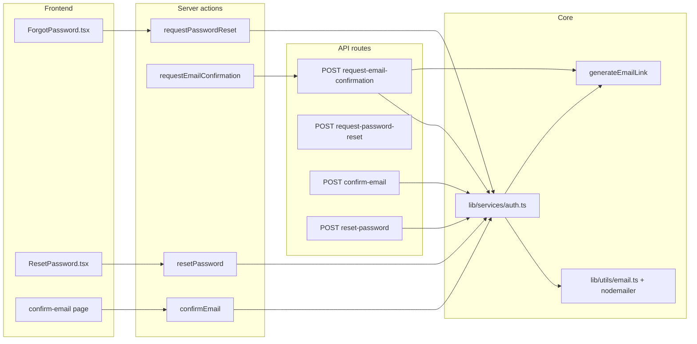

# Auth email flows: confirmation, forgot password, reset password

> Legacy reference from a Next.js prototype. This is **not** the current `restaurant-pos` implementation.  
> Use `documentation/auth-email-security-flows.md` for the active Fastify + React flow.

This document describes how this **Next.js** app implements transactional emails for **email confirmation**, **forgot password**, and **reset password**, including frameworks, file layout, wiring between UI and backend, URL generation, and templates. Use it as a blueprint when porting the same pattern to another application.

---

## Stack and dependencies

| Layer | Technology |
|--------|------------|
| Framework | **Next.js 15** (App Router) |
| UI | **React 19**, **Tailwind** (utility classes), **shadcn-style** `Button` |
| i18n | **next-intl** (`useTranslations` / `getTranslations`) — locale-prefixed routes under `app/[locale]/` |
| Forms / UX | **react-hook-form**, client toasts (`showToast`) |
| Auth | **NextAuth v5** (`next-auth`) — credentials + Google; email flows are separate from NextAuth’s built-in email provider |
| Database | **MongoDB** via **Mongoose** |
| Password hashing | **bcrypt** |
| Tokens | **Node `crypto`** — `randomBytes(32).toString("hex")` (opaque tokens, stored in DB) |
| Email transport | **Nodemailer** — Gmail SMTP (`service: "gmail"`, `EMAIL_USER` / `EMAIL_PASSWORD`) |

**Environment variables (email):**

- `EMAIL_USER` — Gmail address used as SMTP user and `from` identity
- `EMAIL_PASSWORD` — Gmail app password (or equivalent)
- For link generation in production: request host / `VERCEL_URL` / `NEXTAUTH_URL` / `BASE_URL` (see `lib/utils/emailLinkGenerator.ts` and `lib/utils/getBaseUrl.ts`)

---

## High-level architecture

1. **Domain logic** lives in `lib/services/auth.ts` (DB, tokens, hashing, orchestration for password reset email).
2. **HTTP API** under `app/api/v1/auth/*` exposes JSON endpoints (some UIs use these; some flows call **server actions** instead).
3. **Server actions** in `app/actions/auth/*` are the preferred bridge from **client components** and some server code (signup) to services or internal HTTP.
4. **Localized pages** live in `app/[locale]/…` and render **client** or **server** components that call actions or render results.
5. **Email bodies** are **inline HTML strings** (not React Email / MJML files). Translations for email copy are colocated with the template (confirmation in the API route file; password reset in `lib/utils/emailTemplates.ts`).
6. **Links in emails** point to **localized front-end URLs** built by `generateEmailLink()` so the path segment matches the user’s language (e.g. `/pt/confirmar-email?token=…`).

---

## Data model (User)

Relevant fields in `app/api/models/user.ts`:

- `emailVerified` (boolean, default `false`)
- `verificationToken` (string, optional) — email confirmation
- `resetPasswordToken` (string, optional)
- `resetPasswordExpires` (Date, optional) — **1 hour** after request (`Date.now() + 3600000`)
- `preferences.language` — used to pick locale for email links and template language

**Security patterns used everywhere:**

- **Do not enumerate users**: if email is unknown, respond with the same generic success message as when the user exists (confirmation and password reset).
- **Rollback tokens on send failure**: if sending email fails, clear `verificationToken` or `resetPasswordToken` / `resetPasswordExpires` so stale tokens are not left usable.
- **Password reset**: token must match and `resetPasswordExpires` must be in the future.

---

## Flow 1: Email confirmation

### When it is triggered

1. **After credentials signup** — `POST /api/v1/users` (`app/api/v1/users/route.ts`) calls `requestEmailConfirmation(email)` after `createUserService` (user is created with an initial `verificationToken` in `lib/services/users.ts`, then the confirmation endpoint **regenerates** a token via `requestEmailConfirmationService`).
2. **After new Google OAuth user** — `signIn` callback in `app/api/v1/auth/[...nextauth]/auth.ts` saves user + `verificationToken`, then calls `requestEmailConfirmation(profile.email)`.
3. **Manual resend** — e.g. from `components/Profile.tsx` via `requestEmailConfirmation(user.email)`.

### Backend steps

1. `requestEmailConfirmationService(email)` (`lib/services/auth.ts`): validate email, find user, error if already verified, set new `verificationToken`, return user + token (or `user: null` if not found).
2. **Sending the email** is done in **`POST /api/v1/auth/request-email-confirmation`** (`app/api/v1/auth/request-email-confirmation/route.ts`):
   - Uses `getBaseUrlFromRequest(req)` so links match the incoming request origin in production.
   - `generateEmailLink("confirm-email", { token }, userLocale, baseUrl)` → e.g. `https://example.com/pt/confirmar-email?token=…`
   - Builds HTML/text with **inline** `emailConfirmationTemplate` and **local `emailTranslations`** inside the same route file (duplicate Nodemailer setup vs `lib/utils/email.ts`).
   - On SMTP failure: clears `verificationToken` on the user and returns 500.

### Frontend: consuming the link

- Route: `app/[locale]/confirm-email/page.tsx`
- Reads `searchParams.token`
- If missing: shows error copy from `next-intl` namespace `confirmEmail`
- If present: calls **`confirmEmailAction(token)`** (`app/actions/auth/confirmEmail.ts`) → **`confirmEmailService`**:
  - Finds user by `verificationToken`
  - Transaction: set `emailVerified: true`, clear token; if `subscriptionId`, update linked `Subscriber.emailVerified`
- UI: `components/server/ConfirmEmailUI.tsx` (success/error layout)

**Note:** There is also **`POST /api/v1/auth/confirm-email`** for JSON clients; the main app path uses the **server action**, not this route, for the confirm page.

### Server action vs API for “request confirmation”

- `app/actions/auth/requestEmailConfirmation.ts` **`fetch`es** `POST /api/v1/auth/request-email-confirmation` using `getBaseUrl()` so the API route runs in a normal request context (and receives correct `Host` for link building). Password reset does **not** use this indirection; it calls `sendPasswordResetEmail` directly from the action.

---

## Flow 2: Forgot password (request email)

### Frontend

- Page: `app/[locale]/forgot-password/page.tsx` — redirects logged-in users to profile/dashboard
- Form: `components/ForgotPassword.tsx` — `react-hook-form`, **`requestPasswordResetAction(email)`**

### Backend

- Server action: `app/actions/auth/requestPasswordReset.ts` → **`sendPasswordResetEmail`** in `lib/services/auth.ts`
- That function:
  1. Calls **`requestPasswordResetService`** — sets `resetPasswordToken` + `resetPasswordExpires` (1 hour)
  2. If no user: returns generic success message
  3. **`generateEmailLink("reset-password", { token }, userLocale)`** (no `baseUrl` here — resolved inside `emailLinkGenerator` via headers / env)
  4. **`passwordResetTemplate`** from `lib/utils/emailTemplates.ts` (multi-locale strings + HTML)
  5. **`sendEmail`** from `lib/utils/email.ts` (shared Nodemailer helper)

**Optional HTTP API:** `POST /api/v1/auth/request-password-reset` (`app/api/v1/auth/request-password-reset/route.ts`) — thin wrapper around `sendPasswordResetEmail` for non–server-action clients.

---

## Flow 3: Reset password (submit new password)

### Frontend

- Page: `app/[locale]/reset-password/page.tsx` — reads `token` from query; passes to `components/ResetPassword.tsx`
- Client form validates with **`passwordValidation`** (`lib/utils/passwordValidation.ts`) — aligned with server rules in `resetPasswordService`
- Submits via **`resetPassword(token, newPassword)`** server action (`app/actions/auth/resetPassword.ts`)

### Backend

- **`resetPasswordService`** (`lib/services/auth.ts`): find user by `resetPasswordToken` and non-expired `resetPasswordExpires`, hash new password with bcrypt, clear reset fields

**Optional HTTP API:** `POST /api/v1/auth/reset-password` with JSON `{ token, newPassword }` (`app/api/v1/auth/reset-password/route.ts`).

---

## Email templates: how they are built

| Email | Where defined | Format |
|--------|----------------|--------|
| Confirmation | `app/api/v1/auth/request-email-confirmation/route.ts` — `emailTranslations` + `emailConfirmationTemplate` | Inline HTML string + plain `text` |
| Password reset | `lib/utils/emailTemplates.ts` — `passwordResetTemplate` | Same pattern |

Both use:

- Per-locale objects (`en`, `pt`, `es`, `fr`, `de`, `it`) for subject, greeting, body, CTA label, footer, fallback link text
- **Branded header** (gradient, app name) and a single **primary button** linking to the full URL
- **Plain-text** duplicate for clients that do not render HTML

There is **no** separate `.html` file or React Email component; porting means copying these functions or extracting them to a shared module.

---

## Localized URLs (`generateEmailLink`)

- **File:** `lib/utils/emailLinkGenerator.ts`
- **Route map:** `lib/utils/routeTranslation.ts` — keys `confirm-email` and `reset-password` (and `forgot-password` for site navigation) map to slug per locale
- **URL shape:** `{baseUrl}/{locale}/{translatedSlug}?{query}`
- **Base URL:** `getBaseUrlFromRequest` (API routes with explicit request), or `getBaseUrl` / internal fallbacks in `emailLinkGenerator` (dev → `http://localhost:3000`, then headers, `VERCEL_URL`, `NEXTAUTH_URL`, `BASE_URL`, hardcoded production fallback in generator)

---

## i18n (UI strings, not email body)

For pages and toasts, copy lives in **`messages/*.json`** under:

- `ForgotPassword`
- `ResetPassword`
- `confirmEmail` (page copy)
- `metadata.*` keys used by `generatePrivateMetadata` for titles

Locales in repo typically include at least: `en`, `pt`, `es`, `fr`, `de`, `it`.

---

## Related files checklist (copy/reference list)

Use this as a manifest when cloning the pattern elsewhere.

### Core services and utilities

- `lib/services/auth.ts` — confirmation + reset services, `sendPasswordResetEmail`
- `lib/utils/email.ts` — Nodemailer transporter + `sendEmail` + `validateEmailConfig`
- `lib/utils/emailLinkGenerator.ts` — localized absolute URLs for emails
- `lib/utils/emailTemplates.ts` — password reset email HTML/text
- `lib/utils/getBaseUrl.ts` — `getBaseUrl()`, `getBaseUrlFromRequest()`
- `lib/utils/routeTranslation.ts` — slug translations for `confirm-email`, `reset-password`, `forgot-password`
- `lib/utils/passwordValidation.ts` — shared password rules (client + server alignment)
- `app/api/models/user.ts` — schema fields for tokens and verification

### API routes (REST)

- `app/api/v1/auth/request-email-confirmation/route.ts` — POST: service + **send confirmation email** (template inline)
- `app/api/v1/auth/confirm-email/route.ts` — POST: JSON confirm (optional vs server action)
- `app/api/v1/auth/request-password-reset/route.ts` — POST: forgot password email
- `app/api/v1/auth/reset-password/route.ts` — POST: apply new password
- `app/api/utils/handleApiError.ts` — shared API error helper

### Server actions

- `app/actions/auth/requestEmailConfirmation.ts`
- `app/actions/auth/confirmEmail.ts`
- `app/actions/auth/requestPasswordReset.ts`
- `app/actions/auth/resetPassword.ts`

### App pages (locale)

- `app/[locale]/confirm-email/page.tsx`
- `app/[locale]/forgot-password/page.tsx`
- `app/[locale]/reset-password/page.tsx`

### UI components

- `components/ForgotPassword.tsx`
- `components/ResetPassword.tsx`
- `components/server/ConfirmEmailUI.tsx`

### Triggers outside dedicated pages

- `app/api/v1/users/route.ts` — POST signup → `requestEmailConfirmation`
- `app/api/v1/auth/[...nextauth]/auth.ts` — Google new user → `requestEmailConfirmation`
- `components/Profile.tsx` — resend confirmation

### i18n messages (all locales you support)

- `messages/en.json` (and `pt`, `es`, `fr`, `de`, `it`) — namespaces: `ForgotPassword`, `ResetPassword`, `confirmEmail`, relevant `metadata` keys

### User creation (token seeding)

- `lib/services/users.ts` — `createUserService` sets initial `verificationToken` / `emailVerified`

### Navigation entry points

- `components/SignIn.tsx` — link to `/{locale}/forgot-password`

---

## Implementation notes when porting

1. **Unify email sending** if desired: confirmation currently duplicates Nodemailer in the route; password reset uses `lib/utils/email.ts`. A single helper reduces drift.
2. **Verification token expiry**: marketing copy in the confirmation email mentions a 24-hour expiry; confirm **`confirmEmailService` does not enforce a timestamp** on `verificationToken` — only password reset enforces `resetPasswordExpires`. Add a field + check if you need hard expiry for confirmation.
3. **Google OAuth**: new users get `emailVerified: false` and must confirm via the same link flow as credentials users.
4. **Transactional dependency**: user creation in `users/route.ts` does not fail if confirmation email fails (logged only); tokens may remain until the user requests a new email.

---

## Quick API reference

| Intent | Method | Path | Body |
|--------|--------|------|------|
| Send confirmation email | POST | `/api/v1/auth/request-email-confirmation` | `{ "email": "..." }` |
| Confirm email (API) | POST | `/api/v1/auth/confirm-email` | `{ "token": "..." }` |
| Send reset email | POST | `/api/v1/auth/request-password-reset` | `{ "email": "..." }` |
| Set new password (API) | POST | `/api/v1/auth/reset-password` | `{ "token": "...", "newPassword": "..." }` |

The **confirm-email** and **reset-password** pages in this app primarily use **server actions** that call `lib/services/auth.ts` directly (except **request confirmation**, which goes through the API route via `fetch`).
