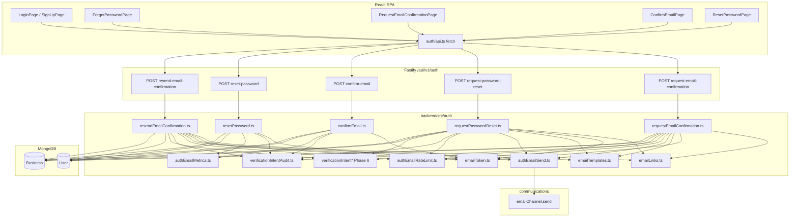
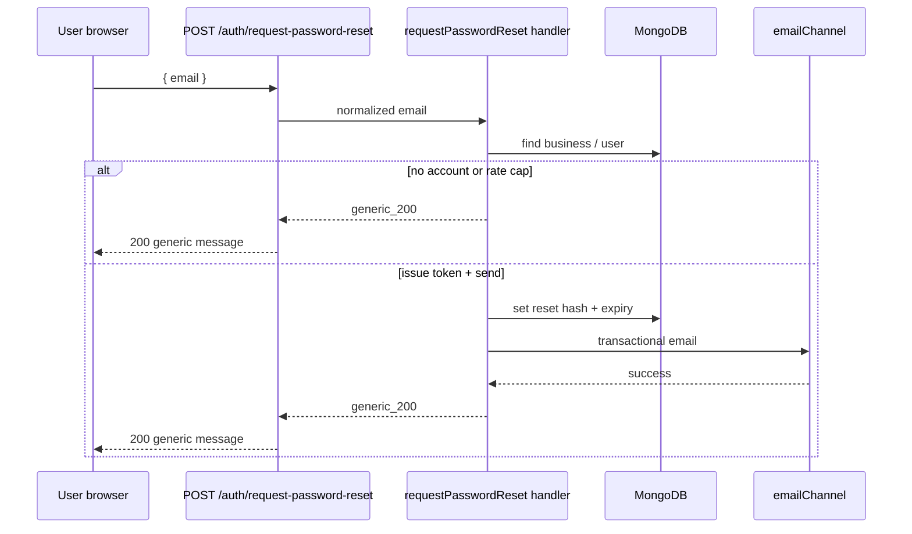

# Auth email security flows (verification, password reset, observability)

This document is the **authoritative technical reference** for **email-driven account security** in Restaurant POS: **sign-in email confirmation**, **forgot / reset password**, **resend confirmation**, integration with **signup** and **business registration**, and how that work fits **JWT refresh invalidation**, **rate limits**, **SMTP**, and **audit/metrics**.

**Companion docs:** backend session mechanics and middleware live in [`authentication-and-session.md`](./authentication-and-session.md). **Web routes, guards, and client session** live in [`frontend-authentication-and-navigation.md`](./frontend-authentication-and-navigation.md). **Product narrative** touches [`user-flow.md`](./user-flow.md) and the bridge [`context.md`](./context.md).

**Implementation plan / checklist:** [`TODO-auth-email-security-flows-implementation.md`](../TODO-auth-email-security-flows-implementation.md) (phases 0–9).

---

## 1. Goals and scope (V1)

| Goal | Behavior |
|------|----------|
| **Verify sign-in email** | Opaque **one-time** link; **hashed** token in MongoDB; **expiry** enforced. |
| **Reset forgotten password** | Same token model; **shorter TTL** than confirmation. |
| **Actors** | Both **`User`** (person) and **`Business`** (tenant) — same priority as login (**business first**, then user). |
| **Login before verify** | **Allowed** — `emailVerified` on session drives UI (banner, resend); login is **not** blocked for unverified accounts in V1. |
| **Enumeration resistance** | Request endpoints return **HTTP 200** + **generic** body whether or not the address exists. |
| **SMTP** | Reuse **`backend/src/communications/channels/emailChannel.ts`** (nodemailer path); auth emails use **`sendAuthTransactionalEmail`** / **`sendAuthTransactionalEmailWithRollback`**. |
| **Refresh sessions after password change** | **`refreshSessionVersion`** on `User` / `Business`; refresh JWT carries **`v`**; mismatch → **`401`** on **`POST /auth/refresh`**. |

**Explicitly out of V1 (per plan):** email confirmation gate on **tenant credential PATCH** (business settings password change still uses **current password** only, no separate email link).

---

## 2. High-level architecture

---

## 3. Security patterns (non-negotiables)

### 3.1 Token storage: hash only

- **Raw** token is generated once (**64 hex chars**, 32 random bytes — `generateRawEmailToken`).
- **Stored** value is **`SHA-256` hex** of `rawToken + AUTH_EMAIL_TOKEN_PEPPER` (`hashEmailToken`). Optional **`AUTH_EMAIL_TOKEN_PEPPER`** hardens DB leaks.
- Lookup is always **`findOne({ *TokenHash: digest })`** with **expiry** and **business rules** in the same query / atomic update.

### 3.2 Anti-enumeration

- **`POST request-email-confirmation`** and **`POST request-password-reset`** return **200** + the **same generic `message`** when:
  - the email is unknown,
  - the account is already verified (confirmation),
  - or **per-email rate cap** is exceeded (still **no send**, still **200**).
- **429** is reserved for **per-IP** sliding-window limits on those routes (and resend).

### 3.3 Rate limiting (process-local)

- **Per IP** — separate counters per route: `request-email-confirmation`, `request-password-reset`, `resend-email-confirmation`. Env: **`AUTH_EMAIL_RATE_LIMIT_IP_MAX`** (default 30), **`AUTH_EMAIL_RATE_LIMIT_IP_WINDOW_MS`** (default 15 min).
- **Per intent + normalized email** — **`tryConsumeVerificationIntentEmailSlot`** keys by **`${VerificationIntent}:${email}`** so confirmation vs reset do not share one bucket. Env: **`AUTH_EMAIL_RATE_LIMIT_EMAIL_MAX`** (default 5 / window), **`AUTH_EMAIL_RATE_LIMIT_EMAIL_WINDOW_MS`** (default 1 h).
- **Scaling note:** maps live **in memory per Node process**; horizontal scale requires ops awareness (sticky sessions do not fix this — consider Redis later if needed).

### 3.4 TTLs

| Token kind | Env override | Default |
|------------|--------------|---------|
| Email confirmation | `AUTH_EMAIL_CONFIRM_TTL_MS` | **24 h** |
| Password reset | `AUTH_RESET_TTL_MS` | **1 h** |

Parsed in **`emailToken.ts`**; invalid / non-positive env falls back to defaults.

### 3.5 Link base URL (no host guessing from request)

- Links are built only from **trusted env** (`APP_BASE_URL` → `PUBLIC_APP_URL` → `FRONTEND_URL` → `VITE_APP_BASE_URL` on server). See **`emailLinks.ts`** and **`backend/README.md`** (Auth email env table).

### 3.6 Refresh session invalidation

- **`refreshSessionVersion`** (non-negative integer, default **0**) on **`User`** and **`Business`**.
- **Refresh JWT** payload includes **`v`** (see `RefreshTokenPayload` in `backend/src/auth/types.ts`).
- **`POST /auth/refresh`**: if **`(payload.v ?? 0) !== dbVersion`**, cookie cleared + **401** (same user-visible message as invalid refresh).
- **Increment** (`$inc: 1`) on: successful **email password reset** (`resetPassword.ts`), **authenticated password change** on **`PATCH /business/:id`** and **`PATCH /users/:id`** when `password` is updated.

---

## 4. Data model (MongoDB)

### 4.1 `User` (`backend/src/models/user.ts`)

| Field | Purpose |
|--------|---------|
| `emailVerified` | Boolean; drives session `emailVerified` and UI. |
| `emailVerificationTokenHash` / `emailVerificationExpiresAt` | Confirmation flow (sparse indexes). |
| `passwordResetTokenHash` / `passwordResetExpiresAt` | Reset flow (sparse indexes). |
| `refreshSessionVersion` | Invalidates refresh JWTs after password change / reset. |

### 4.2 `Business` (`backend/src/models/business.ts`)

Same field names at **top level** (tenant `email` is sign-in identity).

---

## 5. Verification intent framework (Phase 6)

Shared package: **`packages/authVerificationIntent.ts`** — enum **`VerificationIntent`** (`email_confirmation`, `password_reset`, extensible).

| Module | Role |
|--------|------|
| **`verificationIntentToken.ts`** | Create **raw** token + **hash** + **expiry** for an intent. |
| **`verificationIntentConsume.ts`** | Dispatch **consume** to **`confirmEmail`** / **`resetPassword`**. |
| **`verificationIntentAudit.ts`** | **Stdout JSON** audit lines (`scope: "verification_intent_audit"`) — **never** log raw tokens. |
| **`verificationIntentContract.ts`** | Typed **consume** result for routes. |

**Audit phases:** `issue_skipped`, `token_persisted`, `delivered`, `delivery_failed`, `consumed`, `consume_rejected`, `consume_failed`; optional **`rejectReason`**: `invalid_token`, `not_found_or_expired`, `server`.

---

## 6. HTTP API (auth plugin)

All paths below are under **`/api/v1/auth`**.

| Method | Path | Auth | Description |
|--------|------|------|-------------|
| `POST` | `/request-email-confirmation` | None | Body `{ email }`. Validates email; **200** + generic message. Sends only if account exists, needs verify, passes email-slot rate limit. |
| `POST` | `/request-password-reset` | None | Same shape/response style; issues **reset** token + email when applicable. |
| `POST` | `/confirm-email` | None | Body `{ token }`. **400** if token missing; otherwise **one-time** verify or generic consumption error copy. |
| `POST` | `/reset-password` | None | Body `{ token, newPassword }`. Policy + **400** paths for weak/missing fields; success clears reset fields and **increments** `refreshSessionVersion`. |
| `POST` | `/resend-email-confirmation` | Bearer | Resend for **current** session’s DB email; **IP** rate limit; **401** if no/invalid token or account missing. |

**Signup / registration triggers (non-blocking):**

- **`POST /auth/signup`** — after **201**, fires **`handleRequestEmailConfirmation(email)`** (errors logged only).
- **`POST /business`** — after tenant create + session, same pattern for registration email.

---

## 7. Orchestration modules (backend)

### 7.1 Request confirmation — `requestEmailConfirmation.ts`

1. **Business.findOne({ email })** then **User** if no business (same order as login).
2. Skip send: no account, already verified, or **`tryConsumeVerificationIntentEmailSlot(EmailConfirmation, email)`** false → **generic_200**.
3. **`createIntentTokenForVerificationIntent`**, **`updateOne`** hash + expiry, **`buildConfirmEmailLink`**, **`buildEmailConfirmationContent`**, **`sendAuthTransactionalEmailWithRollback`** (rollback clears token fields on SMTP failure).

### 7.2 Request reset — `requestPasswordReset.ts`

Same structural pattern with **`VerificationIntent.PasswordReset`**, **`buildResetPasswordLink`**, and password-reset template content.

### 7.3 Confirm — `confirmEmail.ts`

**Atomic** `findOneAndUpdate` on **Business** then **User**: matching **hash**, **`emailVerified !== true`**, **`emailVerificationExpiresAt > now`**. Success sets **`emailVerified: true`** and unsets token fields. Single **client-facing** error string for all other failures (**no oracle**).

### 7.4 Reset password — `resetPassword.ts`

**Atomic** update: matching **reset** hash + expiry; sets **bcrypt** password; clears reset fields; **`$inc refreshSessionVersion`**.

### 7.5 Resend — `resendEmailConfirmation.ts`

Uses **session** (`AuthBusiness` / `AuthUser`) to resolve document and **DB email** only (no body email — avoids session/email mismatch).

### 7.6 Send path — `authEmailSend.ts`

Calls **`emailChannel.send`** with **`fireAndForget: true`**, inspects **`success`**, on failure runs **rollback** callback then throws (caller maps to **500** where appropriate).

---

## 8. Frontend

### 8.1 Routes (`frontend/src/appRoutes.tsx`)

| Path | Guard | Page |
|------|-------|------|
| `/forgot-password` | `PublicOnlyRoute` | `ForgotPasswordPage` |
| `/request-email-confirmation` | `PublicOnlyRoute` | `RequestEmailConfirmationPage` |
| `/reset-password?token=` | **None** (email links may arrive while logged in) | `ResetPasswordPage` |
| `/confirm-email?token=` | **None** | `ConfirmEmailPage` |

### 8.2 Client API (`frontend/src/auth/api.ts`)

| Function | Endpoint |
|----------|----------|
| `requestEmailConfirmation(email)` | `POST …/request-email-confirmation` |
| `requestPasswordReset(email)` | `POST …/request-password-reset` |
| `confirmEmail(token)` | `POST …/confirm-email` |
| `resetPassword(token, newPassword)` | `POST …/reset-password` |
| `resendEmailConfirmation()` | `POST …/resend-email-confirmation` (Bearer) |

All use **`credentials: "include"`**; email flows pass **`retryOnUnauthorized: false`** to **`authRequest`**.

### 8.3 UX / i18n

Copy lives in **`frontend/src/i18n/locales/*/auth.json`** (`forgotPassword`, `resetPassword`, `confirmEmail`, `requestEmailConfirmation`). **Login** links to forgot + resend confirmation paths.

**Business tenant:** **`BusinessCredentialsSettingsPage`** (**`/business/:id/settings/credentials`**) calls **`requestPasswordReset`** with the **session business email** so staff get the same reset link flow while signed in (plus **`resendEmailConfirmation`** when **`emailVerified`** is false). Copy: **`business.credentialsSettings.passwordChangeEmail.*`**.

---

## 9. Observability

| Mechanism | Location |
|-----------|----------|
| **Pino** | `auth_email_http_response` on auth-email routes (`auth.ts`) — `authEmail.route`, `httpStatus`, `reason`. |
| **Audit JSON lines** | `verificationIntentAudit.ts` → stdout; **`SILENCE_VERIFICATION_INTENT_AUDIT=1`** to mute in tests. |
| **In-process metrics** | `authEmailMetrics.ts` — `getAuthEmailMetricsSnapshot()` (HTTP buckets, dispatch success/fail, token consume tallies). |

---

## 10. Environment variables (summary)

| Variable | Role |
|----------|------|
| `APP_BASE_URL` (+ fallbacks) | Absolute links in emails. |
| `AUTH_EMAIL_CONFIRM_TTL_MS`, `AUTH_RESET_TTL_MS` | Token lifetimes. |
| `AUTH_EMAIL_TOKEN_PEPPER` | Optional HMAC pepper for hashing. |
| `AUTH_EMAIL_RATE_LIMIT_*` | IP + email/intent caps. |
| `SMTP_HOST`, `SMTP_PORT` | SMTP transport endpoint for auth-email delivery. |
| `SMTP_USER`, `SMTP_PASS` | Optional SMTP auth credentials; when one is set, both must be set. |
| `SMTP_FROM` | Optional sender override (`From` header). |
| `AUTH_EMAIL_DEV_SINK_ENABLED` | Dev-only fallback: when `true` (and not production), auth-email send path accepts to a console sink if SMTP is unavailable, so forgot/reset/request-confirmation flows stay testable locally. |
| `COMMUNICATIONS_EMAIL_ENABLED`, SMTP settings | See **`backend/src/communications/README.md`** and env table in **`backend/README.md`**. |

---

## 11. Support runbook

### 11.1 “User didn’t get confirmation / reset email”

1. Confirm **`COMMUNICATIONS_EMAIL_ENABLED`** and SMTP env are set; check provider bounce/spam.
2. Confirm **`APP_BASE_URL`** matches the **browser origin** users should open (dev: often `http://localhost:5173`).
3. Check **rate limits**: IP **429** vs silent **200** when **per-email** cap hit (no mail sent by design).
4. Inspect **logs**: `verification_intent_audit` lines — `delivery_failed` vs `delivered`; Pino `auth_email_http_response`.

### 11.1a “Credentials page / forgot-password shows error toast” (HTTP 500 or `Failed to fetch`)

The SPA calls the same **`POST /api/v1/auth/request-password-reset`** as **`ForgotPasswordPage`**. Treat failures in three buckets:

1. **`Failed to fetch` / network errors in the console**  
   - **Backend not running** on the port the browser targets (Vite default: proxy **`/api` → `http://localhost:4000`** in `frontend/vite.config.ts`).  
   - **`VITE_API_BASE_URL` set to another origin** (e.g. `http://localhost:4000`) while the app runs on **`http://localhost:5173`**: that is **cross-origin** (refresh cookie + CORS). **Fix (dev):** `auth/api.ts` **`resolveAuthFetchBaseUrl()`** ignores that mismatch in **`import.meta.env.DEV`** and uses **relative `/api/...`** so the Vite proxy is used (same as leaving **`VITE_API_BASE_URL` empty**; see **`frontend/.env.example`**). **Fix (prod):** set **`CORS_ORIGINS`** on the server to your SPA origin; Fastify registers **`@fastify/cors`** with **`credentials: true`** (`backend/src/server.ts`).

2. **HTTP 500 + generic “Unable to complete this request…”**  
   - **SMTP path**: channel disabled, misconfigured transport, or provider error after token was written — handler rolls back token fields and returns **500** (see **`authEmailSend.ts`** / **`emailChannel.ts`**).  
   - **Missing app base for links**: **`resolveAppBaseUrl()`** in **`emailLinks.ts`** throws if **no** valid **`APP_BASE_URL`** (or **`PUBLIC_APP_URL`** / **`FRONTEND_URL`** / server **`VITE_APP_BASE_URL`**) is set. Link building and send are handled in one **`try`/`catch`** with **rollback** of verification/reset token fields so the account is not left with a unusable hash without mail.

3. **HTTP 429**  
   Per-IP cap on **`request-password-reset`** — wait for the window or adjust **`AUTH_EMAIL_RATE_LIMIT_IP_*`** for dev.

### 11.2 “Link says invalid or expired”

1. **TTL**: confirmation **24h**, reset **1h** by default — user may need a **new** request.
2. **One-time use**: successful **confirm** or **reset** clears token; **reuse** returns consumption error.
3. **Wrong actor**: rare **hash collision** across user/business is not expected; wrong link copied/truncated is more common.

### 11.3 Resend confirmation (authenticated)

- **Customer profile** / **business credentials** UI may call **`resendEmailConfirmation()`** — server uses **DB email** for the session account only.

### 11.4 SMTP / transport failures

- **Rollback**: failed send after DB write clears **token fields** so the user is not stuck with an unusable hash.
- **Retries**: configured via **`COMMUNICATIONS_EMAIL_RETRY_*`** on the channel.
- **Metrics**: `dispatch.failures` in **`getAuthEmailMetricsSnapshot()`** (auth path only).

---

## 12. Automated tests (pointers)

| Area | Tests |
|------|--------|
| Token / links / templates | `backend/tests/auth/emailToken.test.ts`, `emailLinks.test.ts`, `emailTemplates.test.ts` |
| Rate limit | `backend/tests/auth/authEmailRateLimit.test.ts` |
| Send + rollback | `backend/tests/auth/authEmailSend.test.ts` |
| Routes | `requestEmailConfirmation`, `confirmEmail`, `requestPasswordReset`, `resetPassword`, `resendEmailConfirmation`, `auth-email.test.ts` |
| Refresh invalidation after reset | `backend/tests/routes/resetPassword.test.ts` |
| Schema | `userEmailSecuritySchema.test.ts`, `businessEmailSecuritySchema.test.ts` |
| Frontend | `ForgotPasswordPage.test.tsx`, `ResetPasswordPage.test.tsx`, `ConfirmEmailPage.test.tsx`, `RequestEmailConfirmationPage.test.tsx`, `auth/api.test.ts`, `App.routing.test.tsx` |

---

## 13. Related source index

| Path | Notes |
|------|--------|
| `backend/src/routes/v1/auth.ts` | All auth-email routes + login/signup/refresh with **`v`**. |
| `backend/src/auth/issueSession.ts` | **`issueSessionWithRefreshCookie`**, **`readRefreshSessionVersionForAccount`**. |
| `backend/src/communications/channels/emailChannel.ts` | Shared SMTP send. |
| `packages/authVerificationIntent.ts` | Intent enum (shared). |
| `frontend/src/pages/ForgotPasswordPage.tsx` | … |
| `frontend/src/pages/ResetPasswordPage.tsx` | Reads **`token`** from query string. |
| `frontend/src/pages/ConfirmEmailPage.tsx` | Manual confirm button after landing with token. |
| `frontend/src/pages/RequestEmailConfirmationPage.tsx` | Unauthenticated resend request form. |
| `frontend/src/pages/business/BusinessCredentialsSettingsPage.tsx` | Authenticated tenant: **`requestPasswordReset(session email)`** + optional **`resendEmailConfirmation()`**; uses **`BusinessProfileSettingsStaticShell`** and **`useBusinessProfileSettingsGate`** (exported from **`useBusinessProfileSettingsController.ts`**). |

---

## 14. Mermaid — request password reset (happy path)

---

*Last aligned with implementation in the repository that contains this file; when behavior changes, update this document and the companion **`authentication-and-session.md`** / **`frontend-authentication-and-navigation.md`** sections.*
