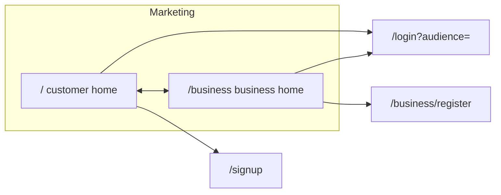

# Frontend authentication and navigation

This document describes **how the Restaurant POS web app handles sign-in, session shape, and routing** for **person users** versus **business (tenant) accounts**, as implemented in `frontend/src`. It is the **frontend companion** to [`authentication-and-session.md`](./authentication-and-session.md) (backend contracts) and aligns with [`FRONTEND_AUTHENTICATION_AND_NAVIGATION_STRATEGY.md`](../FRONTEND_AUTHENTICATION_AND_NAVIGATION_STRATEGY.md) and [`FRONTEND_AUTH_NAVIGATION_IMPLEMENTATION_PLAN.md`](../FRONTEND_AUTH_NAVIGATION_IMPLEMENTATION_PLAN.md).

---

## 1. What you should not confuse (three layers)

The product separates three ideas. Mixing them causes wrong URLs or wrong guards.

| Layer | Question | Driven by | In the UI |
|--------|-----------|-----------|-----------|
| **A — Marketing audience** | Which **public** story we show (customer vs business pitch) | **URL path** while browsing marketing | `/` vs `/business` (and nested paths like `/business/register`). **No `localStorage`**: audience follows the address bar. |
| **B — Account session type** | Who is logged in: **tenant** or **person** | JWT + `GET /api/v1/auth/me` → `user.type` | `"business"` → tenant shell only. `"user"` → person shell (`/:userId/...`). |
| **C — Operational mode (staff only)** | For a **user** linked to an employee: act as **customer** or **employee** in this browser | HttpOnly cookie **`auth_mode`** (`customer` \| `employee`), set via `POST /api/v1/auth/set-mode` | Gates **`/:userId/employee`**. Read through **`GET /api/v1/auth/mode`**. |

**Rules:**

- The **Customer | Business** toggle in the public navbar is **layer A only**. It is **hidden when authenticated** so logged-in users are not encouraged to “switch halves” of the product without signing out.
- **Layer B** decides whether you belong on **`/business/:businessId`** or **`/:userId/*`**.
- **Layer C** applies only when **`type === "user"`** and you use staff URLs; it does **not** turn a person into a business account.

---

## 2. Session model in the client

### 2.1 Types (`frontend/src/auth/types.ts`)

The client mirrors backend session payloads:

- **`AuthBusiness`**: `{ id, email, type: "business" }`.
- **`AuthUser`**: `{ id, email, type: "user", employeeId?, businessId?, canLogAsEmployee? }`.
  - **`employeeId` / `businessId`**: present when the person is linked to an employee record.
  - **`canLogAsEmployee`**: from the backend (schedule + role rules). When `true`, the server considers employee mode **currently allowed** (e.g. management bypass or inside the shift window).

**Union:** `AuthSession = AuthBusiness | AuthUser`.

### 2.2 Auth state (`AuthContext`)

`AuthProvider` holds a small reducer state:

| Field | Meaning |
|--------|---------|
| `user` | Current `AuthSession` or `null`. |
| `status` | `idle` → `loading` → `authenticated` \| `unauthenticated`. |
| `error` | Last auth error message when applicable. |

**Actions:** `AUTH_LOADING`, `AUTH_SUCCESS`, `AUTH_CLEAR`, `AUTH_ERROR`.

**Bootstrap (on app load):**

1. Dispatch `AUTH_LOADING`.
2. **`POST /api/v1/auth/refresh`** (with cookies) to obtain a new **access token** if a refresh session exists.
3. If refresh fails and `localStorage.auth_had_session === "1"`, set a one-time **`sessionStorage.auth_session_expired_notice`** so **`LoginPage`** can show “Session expired”.
4. On successful refresh, store the access token in memory, then **`GET /api/v1/auth/me`** and dispatch **`AUTH_SUCCESS`** with the returned `user`.
5. On success, set **`auth_had_session`** in `localStorage` so the next hard refresh can distinguish “never logged in” vs “session died”.

**Single source of identity:** Components use **`useAuth()`** for `state.user` and `dispatch`. Server lists and schedules use **TanStack Query**; that cache is **not** a second session—it is invalidated on logout and refreshed when needed (e.g. after countdown).

---

## 3. HTTP: two clients, one token

### 3.1 In-memory access token

The **Bearer access token** lives in a **module-level variable** inside `frontend/src/auth/api.ts`, updated by:

- `login`, `signup`, `refreshSession`, `setAccessToken`, and cleared on failed refresh / logout.

**`getAccessToken()`** is imported by **`frontend/src/services/http.ts`** so the shared **axios** instance can attach `Authorization: Bearer …` on every request.

### 3.2 `fetch` (auth module) vs `axios` (`services/http`)

| Area | Client | Notes |
|------|--------|--------|
| Login, signup, refresh, me, logout | **`fetch`** in `auth/api.ts` | Sends `credentials: "include"`, manual `Authorization` header, **401 → refresh + retry** once for API calls. |
| Schedules, auth mode, business create, etc. | **axios** `http` | `withCredentials: true`, **request interceptor** reads the same token via `getAccessToken()`. |

This split is **intentional** during migration: new server I/O is supposed to go through **`services/*`** and TanStack Query; auth bootstrap stays on **`fetch`** until a dedicated migration.

### 3.3 TanStack Query

- **`QueryClientProvider`** wraps the app in `main.tsx` **outside** `AuthProvider` so the query cache survives auth transitions; a comment documents that the token is **not** supplied by React context but by **`auth/api`**.
- Defaults: query **`staleTime` ~ 60s**, **retries** on queries, **no mutation retries**, **`refetchOnWindowFocus: true`** (helps schedule/mode freshness).
- **`queryKeys`** centralize keys for **`auth.mode`** and **`schedules.employeeDay`**, etc.

---

## 4. URL map (canonical routes)

| Path | Layout / guard | Purpose |
|------|----------------|---------|
| `/` | `PublicLayout` | Customer marketing home. |
| `/business` | `PublicLayout` | Business marketing home. |
| `/login`, `/signup` | `PublicLayout` + **`PublicOnlyRoute`** | Auth forms; bounce authenticated users to **`getPostLoginDestination`**. |
| `/business/register` | `PublicLayout` + **`PublicOnlyRoute`** | Tenant signup (multipart API). |
| `/access-denied` | None of the partition guards | Wrong session **type** for a route. Registered **before** `/:userId/*`. |
| `/business/:businessId` | **`ProtectedRoute`** → **`RequireBusinessSession`** → **`BusinessIdRouteGuard`** → **`BusinessLayout`** | Tenant dashboard shell. |
| `/:userId/mode` | **`ProtectedRoute`** → **`RequireUserSession`** → **`UserIdRouteGuard`** | Staff chooses customer vs employee (`set-mode` + navigate). |
| `/:userId/customer` | Same stack + **`CustomerLayout`** + nested **`PostLoginPage`** | Person “customer” app shell. |
| `/:userId/employee` | Same stack + **`RequireEmployeeAuthMode`** + **`EmployeeLayout`** + index **`EmployeeHomePage`** | Staff workspace; requires **`auth_mode=employee`**. |
| `/app` | **`ProtectedRoute`** + **`LegacyAppRedirect`** | Redirects to canonical business or user customer path. |
| `*` | **`CatchAllRedirect`** | Anonymous → `/`; authenticated → **`getPostLoginDestination`**. |

**Lazy-loaded pages** (`App.tsx` / `AppRoutes`: ErrorBoundary + Suspense + `AppPendingShell` `route`): login, signup, business register, business dashboard, mode selection, post-login customer home.

---

## 5. Why route order matters

Dynamic segments **`/:userId/...`** could swallow words like `login` if they were registered **before** static paths. The tree therefore:

1. Nests **marketing and auth** under **`path="/"`** with explicit children (`login`, `signup`, `business`, `business/register`).
2. Declares **`/access-denied`** before any **`/:userId/...`** route.
3. Declares **`/business/:businessId`** before **`/:userId/...`** (business id is not confused with user id at the same path level).

---

## 6. Marketing (anonymous) experience

### 6.1 `SiteAudienceProvider` (`frontend/src/context/SiteAudienceContext.tsx`)

- **`useSiteAudience()`** returns `"customer"` \| `"business"`.
- **Rule:** If pathname is exactly `/business` or starts with `/business/`, audience is **`business`**; otherwise **`customer`** (covers `/`, `/login`, `/signup`, etc.).
- Used for **Sign in** / **Sign up** targets and for the toggle; **not** used for authorization.

### 6.2 `PublicLayout` + `Navbar`

- **`PublicLayout`** wraps children with **`SiteAudienceProvider`**, **`Navbar`**, and **`Outlet`**.
- **When session is loading or unauthenticated:** show **Customer | Business** links (`NavLink` to `/` and `/business`).
- **Sign in** → `/login?audience=customer` or `?audience=business` from current audience.
- **Sign up** → `/signup?audience=customer` for customer audience, or **`/business/register`** for business audience.
- **When authenticated:** toggle is **hidden**; navbar shows email, **Open app** (href **`getPostLoginDestination(user)`**), and **Log out**.

---

## 7. After credentials succeed: `getPostLoginDestination`

**Source:** `frontend/src/auth/postLoginRedirect.ts`.

```
if type === "business"     → /business/{id}
if type === "user" && employeeId (non-empty) → /{id}/mode
else (user, no employee link)               → /{id}/customer
```

So **every person with an employee link** hits **mode selection** first, even if **`canLogAsEmployee`** is false—they can still pick **Continue as customer**; the employee button is disabled or countdown-gated on that page.

**Call sites:** `LoginPage`, `SignUpPage`, `BusinessRegisterPage` (after success), **`PublicOnlyRoute`**, **`CatchAllRedirect`**, **`Navbar`**, **`AccessDenied`**.

---

## 8. Route guards (behavior)

All guards are **UX and consistency**; **security remains on the API**.

### 8.1 `ProtectedRoute`

- If `idle` / `loading` → **`SessionLoading`** (“Loading session…”).
- If not authenticated → **`Navigate` to `/login`**.
- Else render children.

### 8.2 `PublicOnlyRoute`

- Same loading handling.
- If authenticated → **`Navigate` to `getPostLoginDestination(user)`** (e.g. block `/login` when already signed in).

### 8.3 `RequireUserSession` / `RequireBusinessSession`

- Require **`state.user.type`** to be **`user`** or **`business`** respectively.
- Wrong type → **`/access-denied`**.

### 8.4 `UserIdRouteGuard` / `BusinessIdRouteGuard`

- Ensure URL **`userId`** / **`businessId`** **equals** **`state.user.id`** for the matching type.
- Mismatch → redirect to **canonical** path for that session (`canonicalUserCustomerPath` / `canonicalBusinessDashboardPath`) so bookmarks with wrong ids self-correct.

**Helpers** (`frontend/src/routes/sessionPathGuards.ts`): `matchesSessionUserId`, `matchesSessionBusinessId`, canonical path builders, optional **`isLikelyMongoObjectIdString`** for future stricter validation.

### 8.5 `RequireEmployeeAuthMode`

- Uses **`useAuthMode()`** (see below).
- While mode query is loading → **`SessionLoading`**.
- If error or **`mode !== "employee"`** → **`Navigate` to `/${userId}/mode`** so the user can set mode or recover from a stale deep link.

---

## 9. Employee mode: API + context

### 9.1 `authMode` service (`frontend/src/services/authMode.ts`)

- **`getAuthMode()`** — `GET /api/v1/auth/mode` → `"customer"` \| `"employee"`.
- **`setAuthMode(mode)`** — `POST /api/v1/auth/set-mode`. On **403**, throws an error; if the body has no message, the UI can show **`Employee mode not allowed`**.
- **`useAuthModeQuery`**, **`useSetAuthModeMutation`** — cache key **`queryKeys.auth.mode()`**; mutation **invalidates** mode on success.
- **`logout`** in `auth/api.ts` **removes** auth mode queries from the cache.

### 9.2 `AuthModeProvider` (`frontend/src/context/AuthModeContext.tsx`)

- Lives under **`BrowserRouter`** (uses **`useLocation`**).
- Enables **`useAuthModeQuery` only when:**
  - `state.user.type === "user"`, and
  - pathname matches **`/:segment/(customer|mode|employee)`** (regex `isUserShellPath`).
- Exposes **`setModeAndRefresh`**: runs the set-mode mutation (invalidates mode query).

**User-level flow:**

1. User lands on **`/:userId/mode`** (after login if they have **`employeeId`**).
2. **Continue as customer** → `setModeAndRefresh("customer")` → navigate to **`/:userId/customer`**.
3. **Continue as employee** (only when allowed) → `setModeAndRefresh("employee")` → navigate to **`/:userId/employee`**.
4. Opening **`/:userId/employee`** with cookie still **customer** → guard sends them back to **`/:userId/mode`**.

---

## 10. Schedule-backed countdown (staff without bypass)

**Goal:** When **`canLogAsEmployee === false`** but the user has an employee link, the UI shows **when** employee mode may open (five minutes before shift start), aligned with backend rules.

1. **`useNextShiftForEmployee`** (`schedulesService.ts`) — `GET /api/v1/schedules/business/:businessId/daily?dayKey=YYYY-MM-DD` with TanStack Query key **`queryKeys.schedules.employeeDay(...)`**.
2. **`deriveEmployeeModeFromSchedule`** (`employeeModeSchedule.ts`) — pure function: vacation rows skipped; window **`[shiftStart - 5 min, shiftEnd]`**; computes **`countdownTargetMs`** for the next window start.
3. **`ChooseEmployeeModePage`** ticks **`Date.now()`** once per second while countdown relevant; its inline countdown fires **`onReachZero`** → invalidate schedule query and **`getCurrentUser()`** to refresh JWT payload when the server flips **`canLogAsEmployee`**.
4. **Management bypass:** if **`canLogAsEmployee === true`**, the page **does not** show the misleading countdown; employee CTA is enabled from the JWT flag.

---

## 11. Person shell layouts

### 11.1 Customer branch: `CustomerLayout` + `PostLoginPage`

- Route **`/:userId/customer`** uses **`UserCustomerShell`** (guards + **`CustomerLayout`**).
- Header: branding, **Employee** link to **`/${userId}/employee`** only if **`employeeId`** and **`canLogAsEmployee === true`**, **Log out**.
- **Log out:** `logout()`, `setAccessToken(null)`, clear **`auth_had_session`**, `AUTH_CLEAR`, navigate `/`.
- **`PostLoginPage`** is the index child: welcome placeholder (customer home).

### 11.2 Employee branch: `EmployeeLayout` + `EmployeeHomePage`

- **`UserEmployeeShell`** (guards + **`EmployeeLayout`**) with nested index **`EmployeeHomePage`** (home view).
- Minimal placeholder for future POS; reached only through **`RequireEmployeeAuthMode`**.
- Future POS navigation: prefer a **small static list** of routes/labels (colocated with the employee shell or under `navigation/`) instead of a dynamic module registry.

### 11.3 Business shell: `BusinessDashboardPage`

- **`/business/:businessId`**: tenant placeholder UI, logout, session email for business type.

---

## 12. Tenant registration (business)

- **`BusinessRegisterPage`** builds **`FormData`** for **`POST /api/v1/business`** via **`createBusiness`** in **`businessService.ts`**.
- Axios must **not** force `Content-Type` for multipart (transform strips it so the browser sets boundary).
- On success: **`setAccessToken`**, **`dispatch(AUTH_SUCCESS, user)`**, **`navigate(getPostLoginDestination(user))`** → **`/business/:id`**.

---

## 13. Access denied and unknown URLs

- **`/access-denied`**: e.g. business user tried a **user-only** route (or vice versa). Offers **Open your workspace** → **`getPostLoginDestination`** when authenticated.
- **`*`**: **`CatchAllRedirect`** — if authenticated, send to **`getPostLoginDestination`**; else `/`.

---

## 14. Logout and session expiry

- **Logout** clears server session via API, clears in-memory token, drops auth mode queries, client clears **`auth_had_session`** where invoked (layouts/pages).
- **Expired refresh on bootstrap** clears token and may set **`auth_session_expired_notice`** for login UX.

---

## 15. Resilience: error boundary and loading

- **`ErrorBoundary`** in `main.tsx` wraps **`App`** to catch render errors and offer reload / home.
- **Lazy routes** use **`ErrorBoundary`** + **`Suspense`** + **`AppPendingShell`** `route` around **`Routes`** in **`AppRoutes`**; guards use **`SessionLoading`** → **`AppPendingShell`** `session`.

---

## 16. End-to-end journeys (user-level)

### 16.1 Anonymous visitor



Toggle only switches **marketing** URLs; it does not log anyone in.

### 16.2 Login as business (tenant)

1. Submit email/password → **`POST /auth/login`**.
2. Response includes **access token** + **`user.type === "business"`**.
3. **`AUTH_SUCCESS`**, navigate **`/business/{user.id}`**.
4. Guards ensure only that tenant id stays in the URL.

### 16.3 Login as person without staff link

1. **`user.type === "user"`**, no **`employeeId`**.
2. Navigate **`/{user.id}/customer`**.
3. **`CustomerLayout`** — no Employee link unless later **`me`** gains employee fields.

### 16.4 Login as person with staff link

1. Navigate **`/{user.id}/mode`**.
2. Choose **customer** → set cookie **`customer`** → **`/{user.id}/customer`**.
3. Choose **employee** when allowed → set **`employee`** → **`/{user.id}/employee`**.
4. If **`canLogAsEmployee`** is false, UI may show **countdown** until window; at zero, refetch **schedule** and **`me`**.

### 16.5 Deep link to employee URL while in customer mode

1. User opens **`/{id}/employee`**.
2. **`RequireEmployeeAuthMode`** sees **`mode !== employee`**.
3. Redirect **`/{id}/mode`** to confirm or switch mode.

---

## 17. Key file index

| Concern | Location |
|---------|----------|
| Route tree | `frontend/src/App.tsx` |
| Session types | `frontend/src/auth/types.ts` |
| Auth reducer + bootstrap | `frontend/src/auth/store/AuthContext.tsx` |
| fetch auth API | `frontend/src/auth/api.ts` |
| First URL after auth | `frontend/src/auth/postLoginRedirect.ts` |
| Guards | `frontend/src/routes/AuthRouteGuards.tsx` |
| Param matching | `frontend/src/routes/sessionPathGuards.ts` |
| Marketing audience | `frontend/src/context/SiteAudienceContext.tsx` (barrel: `context/index.ts`) |
| Auth mode query + actions | `frontend/src/context/AuthModeContext.tsx` (re-exported from `auth/index.ts`), `frontend/src/services/authMode.ts` |
| Public chrome | `frontend/src/layouts/PublicLayout.tsx`, `frontend/src/components/Navbar.tsx` |
| Mode + countdown UI | `frontend/src/pages/ChooseEmployeeModePage.tsx` |
| Schedule API + query | `frontend/src/services/schedulesService.ts` |
| Schedule math | `frontend/src/utils/employeeModeSchedule.ts` |
| Axios client | `frontend/src/services/http.ts` |
| Query client / keys | `frontend/src/services/queryClient.ts`, `frontend/src/services/queryKeys.ts` |
| Business signup API | `frontend/src/services/businessService.ts` |
| App bootstrap | `frontend/src/main.tsx` |
| Account menu deep links | `frontend/src/navigation/accountPaths.ts` |

---

## 18. Related documentation

- Backend cookies, JWT, and endpoints: [`documentation/authentication-and-session.md`](./authentication-and-session.md).
- Narrative user journey: [`documentation/user-flow.md`](./user-flow.md).
- Strategy and phased delivery: [`FRONTEND_AUTHENTICATION_AND_NAVIGATION_STRATEGY.md`](../FRONTEND_AUTHENTICATION_AND_NAVIGATION_STRATEGY.md), [`FRONTEND_AUTH_NAVIGATION_IMPLEMENTATION_PLAN.md`](../FRONTEND_AUTH_NAVIGATION_IMPLEMENTATION_PLAN.md).

When you change routes, guards, or auth flows, update **this file** and the **user-flow** / **strategy** docs as needed so reviewers and contributors see one story.
