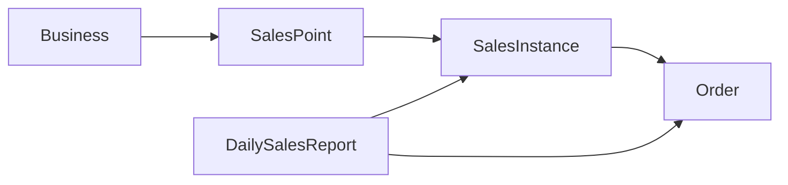

# Sales point, sales instance, and orders

This document describes how **sales points**, **sales instances**, and **orders** interact in the backend, based only on the implementation under `backend/` and shared `packages/`.

## Mental model

- A **sales point** is a physical or logical place where service happens (table, counter, delivery hub). It belongs to a **business** and may allow QR self-ordering or represent delivery.
- A **sales instance** is an open (or closed) **session** tied to one sales point: guests, status, who opened it, and grouped order batches (`salesGroup`). All **orders** for that session reference the same `salesInstanceId`.
- An **order** is one line item (one main `businessGoodId`, optional `addOns`) with pricing, billing state, and kitchen-style `orderStatus`.

`dailyReferenceNumber` links sales instances and orders to the **open daily sales report** for that business (see below).

---

## Data shapes (high level)

### SalesPoint

Defined in `packages/interfaces/ISalesPoint.ts` and `backend/src/models/salesPoint.ts`.

- `businessId`, `salesPointName`, optional `salesPointType` (e.g. `delivery`).
- `selfOrdering`: when `true`, customers may use the self-order flow for this point (subject to route rules).
- `qrCode`: Cloudinary URL for a QR image (non-delivery points get one on create).

**Delivery uniqueness:** `POST /salesPoints` rejects creating a second sales point with `salesPointType === "delivery"` for the same business. Delivery-type points do **not** get a QR code.

**QR payload:** `backend/src/salesPoints/generateQrCode.ts` encodes  
`{BASE_URL}/api/v1/salesInstances/selfOrderingLocation/{salesPointId}`.

### SalesInstance

Defined in `packages/interfaces/ISalesInstance.ts` and `backend/src/models/salesInstance.ts`.

Important fields:

| Field | Role |
|--------|------|
| `dailyReferenceNumber` | Number shared by all activity for the current open day report |
| `salesPointId` | Which sales point this session is on |
| `guests` | Party size (required) |
| `salesInstanceStatus` | `Occupied`, `Reserved`, `Bill`, `Closed` (`packages/enums.ts`) |
| `openedByUserId` | User who started the session |
| `openedAsRole` | `"employee"` (POS / staff) or `"customer"` (self-order / delivery) |
| `paymentId` | Optional string; **sparse unique** index for idempotent customer payment flows |
| `salesGroup` | Array of `{ orderCode, ordersIds[], createdAt? }` batches |
| `reservationId` | Optional; may be set when the first order links a reservation |

### Order

Defined in `packages/interfaces/IOrder.ts` and `backend/src/models/order.ts`.

- Always has `salesInstanceId`, `businessId`, `dailyReferenceNumber`, prices (`orderGrossPrice`, `orderNetPrice`, `orderCostPrice`).
- `billingStatus`: `Open`, `Paid`, `Void`, `Cancel`, `Invitation`.
- `orderStatus`: e.g. `Sent`, `Done` (see `orderStatusEnums` in `packages/enums.ts`).
- `createdByUserId` + `createdAsRole` (`employee` | `customer`) mirror who placed the line.

---

## Daily sales report and `dailyReferenceNumber`

`backend/src/dailySalesReports/createDailySalesReport.ts` creates a document with:

- `dailyReferenceNumber: Date.now()` (Unix ms at creation),
- `isDailyReportOpen: true`,
- `timeCountdownToClose` set 24 hours ahead,
- empty `employeesDailySalesReport` and `selfOrderingSalesReport` arrays.

Flows that need a day key load the **open** report for the business (`isDailyReportOpen: true`). If none exists, they call `createDailySalesReport` inside the same MongoDB transaction (where applicable) and use the returned number on new sales instances and orders.

**Employee tracking:** When `createSalesInstance` runs with `openedByUserId` and `openedAsRole === "employee"`, it ensures that user appears under `DailySalesReport.employeesDailySalesReport` with `hasOpenSalesInstances: true` (`backend/src/salesInstances/createSalesInstance.ts`).

**Self-order analytics:** After a successful customer self-order transaction, the route pushes a structured entry into `DailySalesReport.selfOrderingSalesReport` (payment breakdown, COGS, sold goods). The delivery route in the same file uses the daily reference for the instance and orders but does **not** perform that same `selfOrderingSalesReport` push (per current code).

---

## Who is “employee” vs “customer”?

`backend/src/auth/getEffectiveUserRoleAtTime.ts` is the single rule:

- No `User.employeeDetails` → `customer`.
- Else load `Employee`: wrong `businessId`, not `onDuty`, or schedule not allowed (`canLogAsEmployee`) → `customer`.
- Otherwise → `employee`.

POS and QR **open table** actions require effective role `employee`. Customer self-order explicitly **rejects** users who resolve as `employee` (staff must use the employee flow).

---

## Conflict rules (one open “employee” session per point)

`backend/src/salesInstances/salesInstanceConflicts.ts`:

- **`pointBusyForEmployee`**: there exists a `SalesInstance` for that `salesPointId` + `businessId` with `openedAsRole === "employee"` and `salesInstanceStatus !== "Closed"`. Optional `excludeSalesInstanceId` is used when moving a table.
- **`pointBusyForCustomerSelfOrder`**: currently delegates to the same check—customer self-order is blocked if an employee-open session is active on that point.

Customer-open instances on the same point are **not** part of this “busy” check; idempotency and business rules elsewhere constrain those flows.

---

## Sales instance routes (`backend/src/routes/v1/salesInstances.ts`)

### Employee: open from POS — `POST /salesInstances/`

- Auth required; `openedByUserId` from session.
- Validates `salesPointId`, `guests`, `businessId`; ensures sales point exists for that business.
- Requires `getEffectiveUserRoleAtTime === "employee"`.
- Runs inside `runEmployeeSalesInstanceTxn` → `runTxnWithTransientRetry` (`backend/src/salesInstances/runEmployeeSalesInstanceTxn.ts`, `backend/src/mongo/runTxnWithTransientRetry.ts`) so transient cluster errors can retry.
- Resolves `dailyReferenceNumber` from open `DailySalesReport` or creates one.
- If `pointBusyForEmployee` → **409** “already exists and it is not closed”.
- Builds `openedAsRole: "employee"` and calls `createSalesInstance`.

### Employee: open table from QR location — `POST .../selfOrderingLocation/:selfOrderingLocationId/openTable`

Same core transaction pattern as POS open: must be effective employee, same daily report + conflict checks, `salesPointId` = param, default `guests` 1 if omitted. Returns **201** with the created document (not only a message).

### Employee: patch instance — `PATCH /salesInstances/:salesInstanceId`

Uses optional auth for non-destructive updates; **cancel**, **close with payment**, and **transfer orders** require an authenticated user.

**Restriction:** If the body requests cancel, `paymentMethodArr` + close, or `toSalesInstanceId` transfer, and `openedAsRole !== "employee"`, the handler returns **409**—customer/delivery sessions cannot use these operations on this endpoint.

**Order integrity:** For those operations, every id in `ordersIdsArr` must belong to the correct instance: for close/cancel, the patched instance; for transfer, the **source** instance is `toSalesInstanceId` in the body (the URL id is the **receiver**). Duplicates in `ordersIdsArr` are rejected. Only `billingStatus === "Open"` orders qualify; cancel additionally forbids `orderStatus === "Done"`.

**Cancel:** Management roles only (`managementRolesEnums`); calls `cancelOrders`.

**Close:** Validates `paymentMethodArr` via `validatePaymentMethodArray`, then `closeOrders` (allocates payment lines, sets `Paid`, etc.).

**Transfer:** Validates source instance: same business, employee-open, not closed; then `transferOrdersBetweenSalesInstances` (updates orders’ `salesInstanceId` and mutates `salesGroup` on both instances).

**Empty session cleanup:** If status is `Occupied`, `salesGroup` empty, and the patch is not moving to `Reserved`, the handler may **delete** the sales instance document entirely.

Other patch fields: `guests`, `salesInstanceStatus`, `clientName`, `responsibleByUserId` (requires auth).

### Move session to another sales point — `PATCH .../transferSalesPoint`

- Auth required; only **Host** or a **management** role.
- Instance must not be closed; `openedAsRole` must be `employee`.
- Target sales point must belong to the same business; `pointBusyForEmployee` must be false for the target (excluding current instance).
- Updates `salesInstance.salesPointId` and, if a linked reservation exists, `Reservation.salesPointId`.

### Delete — `DELETE /salesInstances/:salesInstanceId`

Deletes only if `salesGroup` is missing or empty—instances that already have order groups cannot be removed this way.

### Customer: delivery — `POST /salesInstances/delivery`

- Auth required; body includes `businessId`, `ordersArr`, `paymentMethodArr`, optional `deliveryAddress`, required **`paymentId`** (idempotency).

**Idempotency (before transaction):**

- If a customer instance with same `paymentId` exists and is **Closed** → **200**, receipt-style notification, existing `salesInstanceId`.
- If exists and not closed → **409** “already in progress”.

Validates IDs, `ordersArrValidation`, payment methods, business exists, `acceptsDelivery`, `isDeliveryOpenNow`, user exists, resolves address from body or user profile, finds the **delivery** sales point (`salesPointType: "delivery"`).

**Inside a transaction (payment-first):**

1. `applyPromotionsToOrders` with `flow: "delivery"` — only promotions with `applyToDelivery === true` are considered (`backend/src/promotions/applyPromotions.ts`).
2. Sum of `paymentMethodArr.methodSalesTotal` must be ≥ server total net of orders.
3. Ensures `dailyReferenceNumber` (create report if needed).
4. Creates `SalesInstance` with `openedAsRole: "customer"`, `salesPointId` = delivery point, `paymentId`, `responsibleByUserId` = customer, etc.
5. On unique-index race on `paymentId`, aborts and returns the same “already processed” style response as idempotent success.
6. `createOrders` with `createdAsRole: "customer"` (uses promoted pricing output for inserts).
7. `closeOrders` immediately so orders become **Paid** in the same transaction.
8. Commits; low-stock check fire-and-forget; `sendOrderConfirmation` with resolved `orderCode` from `salesGroup`.

### Customer: self-order at table — `POST .../selfOrderingLocation/:selfOrderingLocationId`

- Auth; required `businessId`, `ordersArr`, `paymentMethodArr`, **`paymentId`**.

Same pre-check idempotency pattern as delivery (closed → 200 + notification; in-flight → 409).

Validates sales point: exists, `selfOrdering === true`, business matches. Business must be open (`isBusinessOpenNow`). Effective role must **not** be employee. `pointBusyForCustomerSelfOrder` must be false (employee serving blocks QR self-order).

**Transaction:**

1. `applyPromotionsToOrders` with `flow: "seated"` (non-delivery promotions: `applyToDelivery` must not be true for inclusion).
2. Compares each line’s client `orderNetPrice` / promotion fields to server output within **0.01** tolerance; mismatch → **400**.
3. Payment total ≥ net total.
4. Creates daily report if needed; creates `SalesInstance` with `openedAsRole: "customer"`, `paymentId`, table `salesPointId`.
5. Race on `paymentId` handled like delivery.
6. `createOrders(..., ordersArr, ...)` — the handler passes the **request** `ordersArr` (after validation against server prices).
7. `closeOrders` in the same transaction.
8. Updates `DailySalesReport.selfOrderingSalesReport` with aggregates; on failure aborts.
9. Commits; confirmation email with `orderCode` from `salesGroup`.

---

## Order creation (`backend/src/orders/createOrders.ts`)

Called from the orders route and from sales instance routes above. Always within a **session/transaction** passed by the caller.

1. Loads `SalesInstance` by id + `businessId`; rejects missing or **Closed**.
2. Confirms `salesPointId` on that instance belongs to the same `businessId`.
3. Builds order documents: default `billingStatus: "Open"`, `orderStatus: "Sent"`, stamps `dailyReferenceNumber`, `createdByUserId`, `createdAsRole`, copies prices and line fields from the input array.
4. `Order.insertMany`; `updateDynamicCountSupplierGood` for inventory movement (**remove**).
5. Generates a human-readable **`orderCode`** (date + weekday + random 4 digits) and **`$push`**es one `{ orderCode, ordersIds, createdAt }` entry onto `salesGroup` (each `createOrders` call is one batch).
6. If a reservation exists for this instance in `Arrived` / `Seated` / `Confirmed`, links `reservationId` on first order batch and sets reservation status to `Seated`.

---

## Orders HTTP API (`backend/src/routes/v1/orders.ts`)

### `POST /orders` (employee)

- Auth user session; body: `ordersArr`, `salesInstanceId`, `businessId`, `dailyReferenceNumber`.
- Validates object ids and `ordersArrValidation`.
- Transaction: `applyPromotionsToOrders` with `flow: "seated"`; reconciles client vs server net price and promotion fields (0.01 tolerance); on match, `createOrders` with `createdAsRole: "employee"`.
- Orders stay **Open** until closed via sales instance patch (or other flows).

### `DELETE /orders/:orderId`

- Management-only; loads order’s `salesInstanceId`; `cancelOrders` for that id.

### Queries

List, get by id, by `salesInstance`, by `user` with populate paths for instance → sales point, goods, etc.

---

## Closing orders (`backend/src/orders/closeOrders.ts`)

- Loads all requested ids as **Open** orders on the given `salesInstanceId`.
- Ensures sum of payments ≥ total net; distributes payment methods across lines; sets billing to **Paid** and attaches per-order payment breakdown; handles tips as excess over net.
- Used by: customer self-order/delivery (immediate close), and employee `PATCH` with `paymentMethodArr` + `ordersIdsArr`.

---

## Promotions (`backend/src/promotions/applyPromotions.ts`)

- Loads active promotions for the business; filters by time window and weekdays.
- **`flow: "delivery"`** → only promotions with `applyToDelivery === true`.
- **`flow: "seated"`** (and other non-delivery) → promotions where `applyToDelivery` is not true.
- Best single promotion per order line (lowest net) among those targeting the line’s `businessGoodId`; add-ons are not promotion targets in this logic.

---

## Practical implications

1. **One employee session per physical point** at a time prevents double POS occupation; QR self-order is blocked while that session is open.
2. **Customer** sessions use **`paymentId`** + unique index + pre-checks to make payment retries safe.
3. **`salesGroup`** is the batching model for kitchen/receipt **order codes**; transferring orders moves ids between instances and reshapes `salesGroup` on source and target (`transferOrdersBetweenSalesInstances.ts`).
4. **Employee** table service keeps orders **Open** until staff runs a close (patch) with payment data; **customer** flows pay first and close in the same transaction.

---

## Key files (reference)

| Area | Path |
|------|------|
| Sales instance HTTP | `backend/src/routes/v1/salesInstances.ts` |
| Sales points HTTP | `backend/src/routes/v1/salesPoints.ts` |
| Orders HTTP | `backend/src/routes/v1/orders.ts` |
| Create / close / cancel / transfer orders | `backend/src/orders/createOrders.ts`, `closeOrders.ts`, `cancelOrders.ts`, `transferOrdersBetweenSalesInstances.ts`, `ordersArrValidation.ts` |
| Create instance + conflicts | `backend/src/salesInstances/createSalesInstance.ts`, `salesInstanceConflicts.ts`, `runEmployeeSalesInstanceTxn.ts` |
| Daily report creation | `backend/src/dailySalesReports/createDailySalesReport.ts` |
| Role resolution | `backend/src/auth/getEffectiveUserRoleAtTime.ts` |
| Promotions | `backend/src/promotions/applyPromotions.ts` |
| QR URLs | `backend/src/salesPoints/generateQrCode.ts` |
| Schemas | `backend/src/models/salesInstance.ts`, `order.ts`, `salesPoint.ts` |
| Shared types | `packages/interfaces/ISalesInstance.ts`, `IOrder.ts`, `ISalesPoint.ts` |
| Enums | `packages/enums.ts` |
