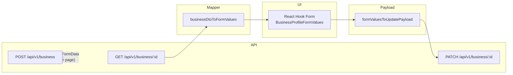

# Business services (`frontend/src/services/business`)

This folder contains the **frontend business domain layer** for registration, profile loading/updating, and related helpers. The design splits **HTTP + React Query**, **DTO → form mapping**, **form → multipart payload**, and **Zod validation** into small modules, with a single **barrel** (`businessService.ts`) as the public entry point for the rest of the app.

---

## Module map

| File | Role |
|------|------|
| `businessService.ts` | **Public barrel**: shared TypeScript types, re-exports API functions and hooks, mapper, and payload builder. |
| `businessProfileApi.ts` | **Transport + TanStack Query**: Axios calls, `BusinessServiceError`, multipart config, profile-update dedupe, diagnostics, React Query hooks. |
| `businessProfileMapper.ts` | **Server → UI**: `businessDtoToFormValues` and normalizers for opening hours / delivery windows / enums. |
| `businessProfilePayload.ts` | **UI → server**: `formValuesToUpdatePayload` builds `FormData` for `PATCH`. |
| `businessProfileFormSchema.ts` | **Validation**: `buildBusinessProfileSchema()` (Zod) aligned with the form shape; composed with i18n messages in **`useBusinessProfileSettingsController`** via **`zodResolver`**. |
| `*.test.ts` | Vitest coverage for API behavior, schema rules, and coalescing. |

---

## Public API and how the app imports it

Application code should import from the barrel path that matches your alias setup. Current usages include:

- `@/services/business/businessService` — **recommended** (explicit file; resolves to this folder’s barrel).

The barrel exports:

- **Types**: `BusinessProfileFormValues`, `BusinessProfileDto`, `BusinessOpeningHourFormValue`, `DeliveryOpeningWindowFormValue`, `ManagementContactOption`, success/response types, etc.
- **Functions**: `createBusiness`, `getBusinessById`, `updateBusinessProfile`, `fetchManagementContactOptions`, `businessDtoToFormValues`, `formValuesToUpdatePayload`.
- **Hooks**: `useBusinessProfileQuery`, `useCreateBusinessMutation`, `useUpdateBusinessProfileMutation`.
- **Errors**: `BusinessServiceError`.

`businessProfileFormSchema.ts` is **not** re-exported from the barrel; the settings shell controller imports it to build the **`zodResolver`** (other callers, e.g. tests, import the module directly).

---

## End-to-end data flow

1. **Load profile**: `useBusinessProfileQuery` → `getBusinessById` → JSON `BusinessProfileDto`.
2. **Hydrate form**: `businessDtoToFormValues(dto)` produces `BusinessProfileFormValues` (defaults, trimmed strings, normalized arrays).
3. **User edits**: form state stays in `BusinessProfileFormValues` shape.
4. **Save**: `formValuesToUpdatePayload(values)` → `FormData` → `updateBusinessProfile(businessId, formData, { operationId? })`.
5. **Register**: registration page builds its own `FormData` and calls `createBusiness(formData)` (same multipart rules as profile update).

---

## `businessService.ts` (type hub + barrel)

This file is intentionally **mostly types and re-exports**:

- Aligns the form model with **`IBusinessProfileDto`** / **`IBusinessProfileAddress`** from `@packages/interfaces/IBusiness.ts` via aliases (`BusinessProfileDto`, etc.).
- Defines **`BusinessProfileFormValues`**, the canonical client-side shape for profile/register-style forms (subscription, credentials for register flows, address, cuisine/categories, delivery flags, metrics, opening hours, delivery windows, reporting).
- Re-exports implementation from `businessProfileApi`, `businessProfileMapper`, and `businessProfilePayload`.

**Dependency note:** `businessProfileApi.ts` imports **types only** from `./businessService` to avoid runtime circular imports; the barrel then re-exports the API module. TypeScript erases those imports at compile time, so the cycle is safe.

---

## `businessProfileApi.ts` (HTTP, errors, React Query)

### Shared HTTP client

Uses `../http` (Axios instance with app defaults, e.g. credentials). All paths are under `/api/v1/...`.

### Multipart (`FormData`) and `Content-Type`

The shared Axios instance may default to `application/json`. For `FormData`, the browser must set **`multipart/form-data` with a boundary**. The module defines `multipartFormDataConfig` with a `transformRequest` that **removes** the `Content-Type` header so Axios lets the runtime set the correct multipart header. This applies to:

- `createBusiness` — `POST /api/v1/business`
- `updateBusinessProfile` — `PATCH /api/v1/business/:businessId`

### `BusinessServiceError`

Extends `ServiceRequestError` from `../serviceErrors.ts`. Failures are normalized with `toServiceRequestError`, using **status-specific** user-facing fallbacks for fetch/update (401, 403, 404, 409 on update, etc.) and a generic message for create.

### Session / token handling

- **`createBusiness`**: on success, if `accessToken` is present, calls `setAccessToken` from `@/auth/api`. Returns `CreateBusinessSuccess` with `user` typed as `AuthBusiness`.
- **`updateBusinessProfile`**: same token refresh behavior; validates returned `user.type === "business"` when present.

### Profile fetch diagnostics

`getBusinessById` logs structured console messages (`scope: "services.businessProfile"`) for success and failure (duration, status, message). Useful when debugging slow or failing loads.

### Profile save: idempotency and in-flight coalescing

- **`X-Idempotency-Key`** and **`X-Correlation-Id`**: set from `options.operationId` if provided, otherwise generated via `createProfileSaveOperationId` (`business-profile-save:{businessId}:{uuid}`). Lets the backend dedupe side effects (e.g. notifications) while the primary PATCH completes.
- **`inFlightProfileUpdates`**: a `Map<businessId, Promise<...>>`. If `updateBusinessProfile` is called again for the same `businessId` while a request is in flight, the **same promise** is returned (coalesced). Diagnostics log `stage: "coalesced"`. The map entry is cleared in `finally` when that promise settles.

### Plain JSON GET (management contacts)

`fetchManagementContactOptions(businessId, signal?)` calls  
`GET /api/v1/employees/business/:businessId/management-contacts` and returns an array (empty array if the response is not an array). Used by controllers/pages that need select options for “contact person” or similar.

### React Query

- **`useBusinessProfileQuery(businessId, enabled?)`**: `queryKey` from `../queryKeys` — `queryKeys.business.detail(businessId)` or `detailPending()` when id is missing; `queryFn` delegates to `getBusinessById` with `signal`.
- **`useCreateBusinessMutation`**: wraps `createBusiness`.
- **`useUpdateBusinessProfileMutation`**: mutation variables `{ businessId, formData, operationId? }` → `updateBusinessProfile`.

---

## `businessProfileMapper.ts` (DTO → form)

### `businessDtoToFormValues(dto)`

Maps `BusinessProfileDto` → `BusinessProfileFormValues`:

- **Strings**: trimmed; missing fields become `""`.
- **Security fields**: `password` / `confirmPassword` empty; `confirmEmail` mirrors `email` from API.
- **Image**: `imageFile: null`; `imageUrl` from DTO.
- **Cuisine**: `normalizeCuisineTypes` supports legacy **string** or **string[]** from API; values are matched case-insensitively against `cuisineTypeEnums` from `@packages/enums.ts`; unknown values dropped.
- **Categories**: `normalizeCategories` maps to `foodSubCategoryEnums`; deduped.
- **Metrics**: nested `supplierGoodWastePercentage` and top-level percentages use **`DEFAULT_BUSINESS_METRICS`** when numbers are missing or non-finite.
- **Opening hours / delivery windows**: `normalizeBusinessOpeningHours` and `normalizeDeliveryOpeningWindows` validate `dayOfWeek` (0–6), require `HH:MM` strings, and drop invalid rows.

These normalizers are **exported** so `businessProfilePayload` can reuse them when serializing form state back to JSON strings inside `FormData`.

---

## `businessProfilePayload.ts` (form → `FormData`)

### `formValuesToUpdatePayload(values)`

Builds the **multipart PATCH** body expected by the backend:

- **Scalar fields**: `tradeName`, `legalName`, `email`, `phoneNumber`, `taxNumber`, `currencyTrade`, `subscription`, `contactPerson`, `acceptsDelivery` (boolean as string).
- **Nested JSON as strings**: `address`, `metrics`, `cuisineType`, `categories`, `businessOpeningHours`, `deliveryOpeningWindows`, `reportingConfig` (only if `weeklyReportStartDay` is a finite number).
- **Optional address keys**: `region`, `doorNumber`, `complement` omitted when empty after trim.
- **Password**: `password` only appended if non-empty (optional update). When present, **`currentPassword`** is appended for backend verification (same field is only collected on **`BusinessCredentialsSettingsPage`** among business settings routes).
- **Delivery**: `deliveryRadius` / `minOrder` only if finite numbers (nullable skipped when null).
- **Enums on write**: `filterToAllowedEnums` restricts `cuisineType` and `categories` to known enum values before `JSON.stringify`.
- **Image**: if `imageFile` is set and `size > 0`, appends file as `imageUrl` (field name matches backend convention for uploads).

**Important:** This function does not perform Zod validation; **`useBusinessProfileSettingsController`** validates with **`zodResolver(buildBusinessProfileSchema(…))`** before calling the mutation.

---

## `businessProfileFormSchema.ts` (Zod)

### `buildBusinessProfileSchema(partialMessages?)`

Returns a Zod object schema whose shape mirrors **`BusinessProfileFormValues`**:

- Subscription and currency enums from `@packages/enums.ts`.
- **`email`** and **`confirmEmail`**: required, both must match **`emailRegex`** from `@packages/utils/emailRegex.ts`, and must equal each other after trim.
- Optional new-password flow: empty both ok; if either new-password field is set, both required, must match, `isValidPassword` from `@packages/utils/passwordPolicy.ts`, and **`currentPassword`** must be non-empty (credentials page + multipart PATCH).
- Opening hours and delivery windows: `HH:MM` regex, `closeTime` after `openTime`, day 0–6.
- Metrics and non-negative numbers for delivery radius / min order (nullable).

Exported types: `BusinessProfileSchema`, `BusinessProfileSchemaValues`.

**Usage:** `useBusinessProfileSettingsController` builds the schema with **`business.profileForm.validation.*`** / **`credentialsSettings.validation.*`** (and **`auth.signup.errors.passwordPolicy`**) and passes it to **`zodResolver`**. **`BusinessProfileSettingsFormShell`** shows a short summary **`Alert`** when submit validation fails. Vitest coverage lives in `businessProfileFormSchema.test.ts`.

---

## Cross-cutting dependencies

| Dependency | Usage |
|------------|--------|
| `@/auth/api` | `setAccessToken` after create/update when JWT returned. |
| `@/auth/types` | `AuthBusiness`, `AuthSession` in response types. |
| `@packages/interfaces/IBusiness.ts` | DTO/metrics shapes. |
| `@packages/enums.ts` | Cuisine, food categories, subscription, currency (schema + mapper + payload). |
| `../http` | Axios instance. |
| `../queryKeys` | Stable React Query keys for business detail. |
| `../serviceErrors.ts` | `ServiceRequestError`, `toServiceRequestError`. |

---

## Loading UI (split business settings)

**`BusinessProfileSettingsFormShell`** passes a **`loadingSlot`** while the profile query is pending. These pages use the shared **`BusinessProfileSettingsLoadingCard`** and compose **`Skeleton`** so the placeholder **matches the loaded DOM** (same `section` / `header` / grid structure), avoiding layout shift:

- **`BusinessProfileSettingsPage`**: one **`section`** with header, logo column + two name fields, then the seven-cell grid (phone, tax, currency, email, cuisine, categories, contact).
- **`BusinessAddressSettingsPage`**: **`section`** + **`header`**, address grid with full-width rows for street and complement, map column with title + map-sized skeleton.
- **`BusinessCredentialsSettingsPage`**: two-column credentials layout + full-width current-password row (see **`documentation/context.md`** *Business credentials settings*).

Repository rule **§13** in **`documentation/context.md`** documents the general skeleton policy; the pages above are reference implementations for profile, address, and credentials.

## Typical consumers in this codebase

- **`useBusinessProfileSettingsController`**: imports hooks and helpers from `@/services/business/businessService` (query, mutations, mapper, payload, management contacts).
- **`BusinessAddressSettingsPage`**: `businessDtoToFormValues` for local form initialization patterns.
- **`BusinessRegisterPage`**: `useCreateBusinessMutation`.
- **`BusinessDeliverySettingsPage`**: type-only import of `BusinessProfileFormValues`.

When adding a new field end-to-end:

1. Extend **`IBusiness`** / backend contract if needed.
2. Extend **`BusinessProfileFormValues`** in `businessService.ts`.
3. Update **`businessDtoToFormValues`** and **`formValuesToUpdatePayload`**.
4. Update **`buildBusinessProfileSchema`** and its tests.
5. Adjust UI and controller; keep **`queryKeys`** and cache invalidation in sync if the query shape changes.

---

## Testing

- **`businessService.test.ts`**: Mocks `../http` and `@/auth/api`; asserts POST/PATCH URLs, multipart `transformRequest`, idempotency headers, token sync, and **concurrent update coalescing**.
- **`businessProfileFormSchema.test.ts`**: Validates representative schema success/failure cases.

Run from the frontend package (e.g. `pnpm vitest run src/services/business` or project-wide test script).

---

## Summary

The **barrel** (`businessService.ts`) defines the **single form/DTO vocabulary** and exports **network + cache** primitives from **`businessProfileApi.ts`**. **`businessProfileMapper.ts`** makes server data safe and consistent for the UI; **`businessProfilePayload.ts`** reverses the mapping into the backend’s **multipart + JSON-in-fields** contract. **`businessProfileFormSchema.ts`** provides optional, strict client validation aligned with that same shape. Together they keep registration, profile settings, and future business flows consistent without a single oversized module.
